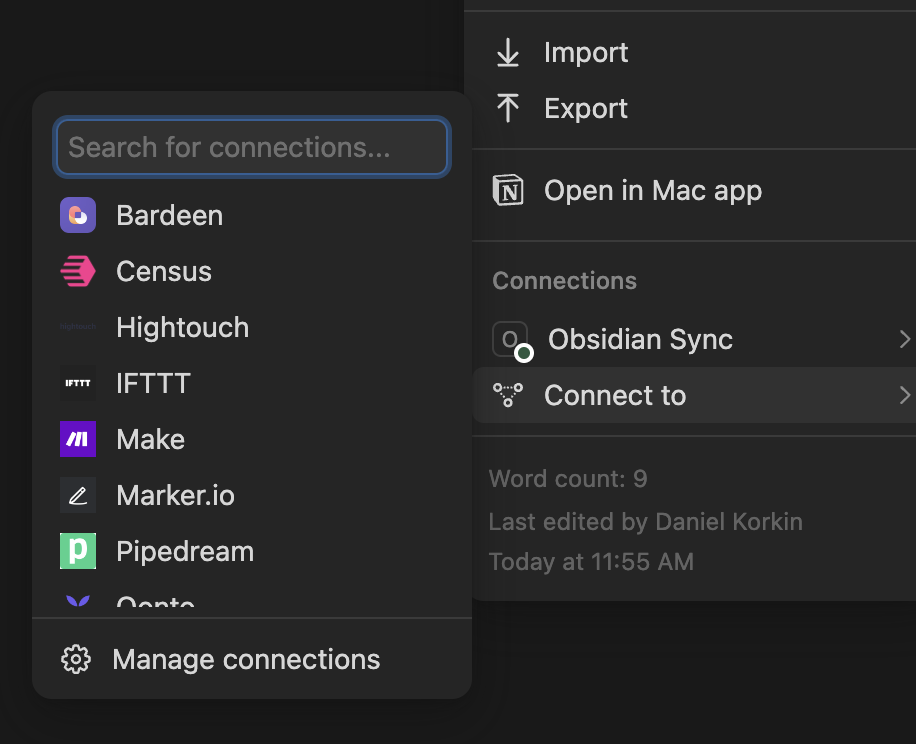

# Obsidian sync to Notion

## Getting Started

### 1. Connect to Notion 

- Go to [Integrations Portal](https://www.notion.so/profile/integrations)
- Click on `New integration`
- Pick out the workspace you want this project to have acess to
- Select Internal on the type of integration (To avoid additional steps)
- Allow all capabilities for this app
- Copy the token into the `.env` file and assign it to the variable: `CLIENT_SECRET`
- Go into the Notion page you want as the parent note page
- Click the 3 dots
 

- Scroll down to the bottom, until you see connect to
 

- Hover over connect to and click the app you want to connect and press confirm
- Now find the your url and find the id of the page:
    - To find the id look at your url and take what ever is after the name in the url:
    Example url: `https://www.notion.so/Example-123456789`
    The id of Example url would be `123456789`
- Assign this id to the `PAGE_ID` variable in the `.env` file

### Connect to Obsidian
- Find the folder of your vault
- Copy the folder structure (ex. `/Users/user/Folder/MyVault/Vault`)
- Assign the folder structure to the `VAULT_PATH` variable in the `.env` file

### Running the program
- Run the program using an ide or `python3 main.py`

## Limitations and TODO
- Limited amount of MD features
- Excalidraw file support
- Multiple vault and page support
- Deletion Support